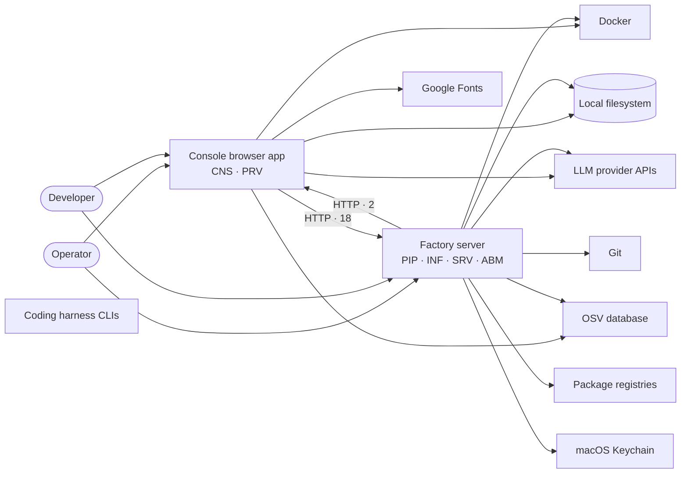
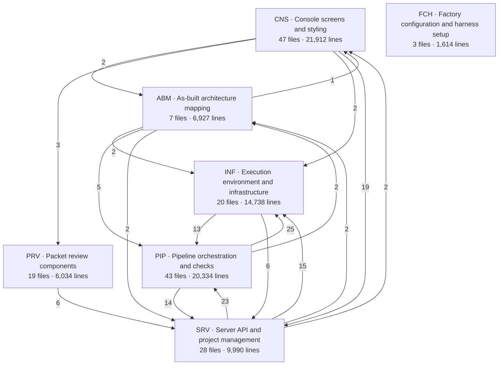

<!-- Generated by Fabrika from the commit named below. Regenerate it; do not edit it. -->

# Fabrika — as built

As built at `4b8570d19ee1`, read 2026-10-07.

Fabrika is a software factory: it runs AI coding agents through a gated pipeline (onboarding, intake/spec, build, verify, converge, review) against a real repository, with deterministic shell-command gates and human checkpoints deciding whether work proceeds. It serves engineering teams who want AI-authored features reviewed and merged with the same rigor as human work, surfaced through a browser console for configuring projects, watching builds, and ruling on review packets. The stack is a Python backend (FastAPI server, Docker-sandboxed execution, LLM call routing) paired with a vanilla JS/Preact console frontend, all driven by a single YAML configuration file. factory/schemas.py defines the Pydantic contracts every agent's output must satisfy, factory/projects.py models the registered repositories and their state, and the console's render.js/data.js dispatch screens against that state over a REST API.

**7 subsystems, 13 capabilities, 271 files.**

## Where to start reading

- [`factory/schemas.py`](files/factory/schemas.py.md) — Defines the output contract every agent in the pipeline must produce, so it explains the shape of the data flowing through the whole system before anything else does.
- [`factory/config.py`](files/factory/config.py.md) — The single YAML-driven source of truth for routes, roles, and provider settings that every other subsystem reads, so it explains how the factory is wired together.
- [`factory/projects.py`](files/factory/projects.py.md) — Defines the Project and ProjectRegistry model that the server, console, and pipeline all operate on, making it the central data model of the system.
- [`factory/pipeline/factory/intake.py`](files/factory/pipeline/factory/intake.py.md) — Orchestrates the first real pipeline phase (scouting, interrogation, spec approval), showing how a feature enters the factory and how the orchestrator mixins pattern works.
- [`console/app/render.js`](files/console/app/render.js.md) — Where the console frontend dispatches screens based on project/feature state, making it the entry point for how a human interacts with the system.

## How it runs

Solid arrows between processes are route calls code matched to a route served; an outside system drawn dashed is only named in configuration or documentation.

- **Console browser app** — Preact-based single-page app, hash-routed; runs in the user's browser.. Runs `CNS`, `PRV`; 11 events, 18 routes, 19 screens.
- **Factory server** — FastAPI app on Python; orchestrates the build pipeline, manages Docker-isolated environments and credentials, serves the console's REST API, and reads/renders the as-built codebase map.. Runs `PIP`, `INF`, `SRV`, `ABM`; 1 command, 9 events, 89 routes, 2 screens.
- **Build and tooling** — `FCH`, GitHub Actions; nothing of it runs.

Used by **Operator** (sets up and administers the Fabrika machine and the projects it builds) — `MST`, `NEG`, `CAP`, `RMP`, `ONB`; **Developer** (uses Fabrika to specify, build, review and ship features) — `NFI`, `RMB`, `RVB`, `PRF`, `VTR`, `VPH`, `VAB`, `EPG`.

| Outside system | For | Named by | Calls in |
|---|---|---:|---|
| Docker | Runs sealed containers and compose services that isolate agent and gate execution from the host and from each other. | 32 files |  |
| Git | Version-controls project repositories: branches, commits and checkouts that the pipeline operates on. | 24 files |  |
| Local filesystem | Stores project checkouts, config, guides, evidence and JSON state read and written by the factory. | 38 files |  |
| LLM provider APIs | Model provider endpoints (and routing layers like LiteLLM/OpenRouter) that the factory calls for every agent completion, onboarding read and review judgement. | 20 files |  |
| Coding harness CLIs | Third-party coding-agent CLIs/SDKs (Claude Code, Codex, Gemini CLI, OpenHands) that the factory drives inside sealed containers to author code. | 3 files |  |
| OSV database | Open Source Vulnerabilities database queried to flag known vulnerabilities in a project's dependencies. | 2 files |  |
| Package registries | PyPI and the npm registry, queried to look up what is publicly known about a project's dependencies. | 2 files |  |
| Google Fonts | Serves webfonts used by the console and documentation pages. | 4 files |  |
| GitHub Actions *(build and tooling)* | Runs this repository's CI workflow. | 1 file |  |
| macOS Keychain | OS credential store accessed via the security command to hold provider API keys. | 1 file |  |

## Subsystems

Arrows are links between files in two subsystems — imports, routes called, files started — counted. Files shared by nearly everything are listed separately and not drawn.

| ID | Subsystem | Files | Lines | What it is for |
|---|---|---:|---:|---|
| `CNS` | [Console screens and styling](subsystems/console-screens-and-styling.md) | 47 | 21,912 | The full set of screens, navigation, and stylesheets that make up the Fabrika console UI: project onboarding and setup, agent/crew configuration, readings and gate reviews, run history and live progress, guides, and the shared CSS that styles all of them. The rest of the system needs this group to give humans a way to configure, monitor, and approve the factory's work, driven by data.js's routing and render.js's screen dispatch. |
| `PIP` | [Pipeline orchestration and checks](subsystems/pipeline-orchestration-and-checks.md) | 43 | 20,334 | Runs the build pipeline end to end: executes gates (deterministic shell checks), coordinates the cut/build/verify/converge phases through the factory orchestrator mixins, tracks findings through the ledger, and assembles the final review packet. This is the deterministic core that decides phase transitions and verifies work while agents do the actual authoring inside each phase. |
| `INF` | [Execution environment and infrastructure](subsystems/execution-environment-and-infrastructure.md) | 20 | 14,738 | Provides the sealed, configured environments agents and gates run in: Docker container and compose management, egress proxying, credential handling, LLM call routing (llm.py, routes.py), guide delivery, and Gate 0 onboarding that proves an environment works before builds start. Configuration (config.py) is the single YAML-driven source of truth that the rest of this infrastructure reads. |
| `SRV` | [Server API and project management](subsystems/server-api-and-project-management.md) | 28 | 9,990 | The FastAPI server layer and the Project/ProjectRegistry model it serves: registers projects, exposes REST endpoints for features, gates, previews, logs, and reviews, and backs the console's UI actions (actions.js, interaction.js) with the data and state they call into. This is how the console frontend and the pipeline backend talk to each other. |
| `ABM` | [As-built architecture mapping](subsystems/as-built-architecture-mapping.md) | 7 | 6,927 | Reads a repository at a given commit and builds the as-built documentation of its structure: subsystems, capabilities, and file relationships, validated against real imports and definitions, then rendered as console pages and Markdown. Lets developers and reviewers see what the codebase actually looks like, including this map-generation system describing itself. |
| `PRV` | [Packet review components](subsystems/packet-review-components.md) | 19 | 6,034 | Preact components for the Gate 2 review experience: tabs for calls, work map, evidence, dependencies, findings, and repair rounds, plus shared state for navigating and deciding on a feature's packet. Gives human reviewers the detailed, criterion-by-criterion view needed to rule on a build before it merges. |
| `FCH` | [Factory configuration and harness setup](subsystems/factory-configuration-and-harness-setup.md) | 3 | 1,614 | The example central YAML configuration declaring routes, roles, and pipeline settings alongside the harness launcher scripts (npm wrapper, OpenHands driver) that let configured coding harnesses actually run. Serves as the reference template and supporting scripts for setting up a working factory instance. |

### Shared by nearly everything

- [`factory/schemas.py`](files/factory/schemas.py.md) — imported by 70 files. Defines Pydantic schemas for the output contracts of every agent in the software factory pipeline. Field descriptions are shipped to the model as part of the JSON schema and serve as instructions.

## Capabilities

**Projects**

- `RMP` [Register and manage projects](capabilities/register-and-manage-projects.md) — Lets a user add a repository to Fabrika as a project, remove it, and adjust its scaffolding and Dockerfile placement so the system can build against it, via export:create_project and the project routes. *9 ways in, 0 reached by a test.*
- `NFI` [Create and track a feature](capabilities/create-and-track-a-feature.md) — Lets a user write a feature's intent, answer the interrogator's questions, review and approve the resulting spec, rule on the architect's cut plan, and see or remove the feature afterward, via export:Start and the feature/intake routes. *30 ways in, 10 reached by a test.*
- `RMB` [Run and monitor a build](capabilities/run-and-monitor-a-build.md) — Lets a user retry or revalidate a feature's build and watch its progress, covering the coding harness driver, model calls, the findings ledger, traceability, gate-result checks and repair planning that execute while the build runs. *53 ways in, 19 reached by a test.*
- `RVB` [Review a build's packet and findings](capabilities/review-a-build-s-packet-and-findings.md) — Lets a reviewer read a feature's calls, evidence, objections and work map, decide on findings, dispatch rework, rebuild and record a final verdict, centered on export:Tabs and the gate-2 review routes. *24 ways in, 2 reached by a test.*
- `PRF` [Preview a running feature](capabilities/preview-a-running-feature.md) — Lets a reviewer open, check the status of, and stop a feature's running preview app in the browser, reaching into the sealed network through the doorway forwarder. *8 ways in, 3 reached by a test.*
- `VTR` [View browser test recordings](capabilities/view-browser-test-recordings.md) — Lets a reviewer list and play back recorded browser test runs for a feature, frame by frame or as a full walkthrough. *4 ways in, 4 reached by a test.*
- `VPH` [View project history and status](capabilities/view-project-history-and-status.md) — Lets a user see a project's event history, status overview and ledger logs, and shows the project status bar and tabs used throughout the console, built from export:project_history and export:summary. *18 ways in, 1 reached by a test.*
- `VAB` [View the as-built codebase map](capabilities/view-the-as-built-codebase-map.md) — Lets a user browse Fabrika's analysis of the committed codebase -- its subsystems, capabilities and files -- and trigger a refresh of that map, via screen:As-built section. *13 ways in, 4 reached by a test.*

**Setup**

- `ONB` [Approve a project's onboarding](capabilities/approve-a-project-s-onboarding.md) — Lets a user review what Fabrika proposed after reading a repository -- checks, guides, recommendations, gates -- decide which to adopt, decline or reinstate, and approve the project so builds can run. Built on export:ProjectOnboarding and the gate-0 routes. *29 ways in, 4 reached by a test.*
- `NEG` [Configure network egress](capabilities/configure-network-egress.md) — Lets a user check, start and test the sealed network's internet access, backed by the egress proxy that validates DNS and TCP connections and the sealed-network management in export:ensure_proxy. *18 ways in, 0 reached by a test.*
- `MST` [Complete initial machine setup](capabilities/complete-initial-machine-setup.md) — Lets a new user walk through commissioning a machine -- starting Docker, storing API keys, installing harnesses, and setting crew and resource limits -- before Fabrika can process features, via screen:#/?setup. *14 ways in, 11 reached by a test.*
- `CAP` [Configure agents, providers and machine settings](capabilities/configure-agents-providers-and-machine-settings.md) — Lets a user assign which provider serves each agent team, set thinking levels, manage provider credentials and routes, track resource usage, and set this machine's editor URL template, via screen:Agent configuration. *25 ways in, 13 reached by a test.*
- `EPG` [Edit prompts and guides](capabilities/edit-prompts-and-guides.md) — Lets a user edit the markdown that defines agent prompts and project guides in a sheet editor, with outline navigation and save-on-close, via export:mountMarkdownEditor. *7 ways in, 0 reached by a test.*

## Worth knowing

- **Console screens and styling (CNS) and As-built architecture mapping (ABM) depend on each other.** 2 links one way, 1 the other.
- **Console screens and styling (CNS) and Server API and project management (SRV) depend on each other.** 19 links one way, 2 the other.
- **As-built architecture mapping (ABM) and Pipeline orchestration and checks (PIP) depend on each other.** 5 links one way, 2 the other.
- **As-built architecture mapping (ABM) and Server API and project management (SRV) depend on each other.** 2 links one way, 2 the other.
- **Execution environment and infrastructure (INF) and Pipeline orchestration and checks (PIP) depend on each other.** 13 links one way, 25 the other.
- **Execution environment and infrastructure (INF) and Server API and project management (SRV) depend on each other.** 6 links one way, 15 the other.
- **Pipeline orchestration and checks (PIP) and Server API and project management (SRV) depend on each other.** 14 links one way, 23 the other.
- **Two files are started, never imported.** Run as a separate process or loaded by path: factory/harnesses/npm_launcher.sh, factory/harnesses/openhands_driver.py. The link is reported by the reader and not confirmed by code.
- **Five routes have no caller in this repository.** GET /api/projects/{project_id}/features, GET /api/projects/{project_id}/features/{feature_id}/intake-plan, GET /api/projects/{project_id}/features/{feature_id}/log/{seq}, GET /api/projects/{project_id}/features/{feature_id}/rework, POST /api/projects/{project_id}/features/{feature_id}/cancel-wait. Either unused, or called from somewhere this reading did not see.
- **One file no way in reaches.** Nothing imports or starts them, and they declare no way in: factory/pipeline/checks/__init__.py. Dead, or loaded by a convention this reading cannot see.
- **59% of the code is not reached by a test.** 116 files of 50 lines or more that no test imports or calls; largest: console/asbuilt.js, factory/pipeline/factory/converge.py, console/app/readings.js, console/app/running.js.
- **console/asbuilt.js comes apart into 9 parts.** The cleanest first cut is Folder diagram rendering -- 370 lines, 1 calls out and 1 in.
- **factory/asbuilt_graph.py comes apart into 5 parts.** The cleanest first cut is Applying architecture metadata -- 214 lines, 1 calls out and 0 in.
- **factory/config.py comes apart into 10 parts.** The cleanest first cut is Route configuration and defaults -- 291 lines, 0 calls out and 1 in.
- **factory/containers.py comes apart into 7 parts.** The cleanest first cut is Building the harness image -- 170 lines, 2 calls out and 0 in.
- **factory/executors.py comes apart into 6 parts.** The cleanest first cut is Building fallback context when the harness fails -- 174 lines, 0 calls out and 1 in.
- **factory/gates.py comes apart into 4 parts.** The cleanest first cut is Setting up the test session environment -- 414 lines, 1 calls out and 1 in.
- **factory/pipeline/factory/converge.py comes apart into 2 parts.** The cleanest first cut is Repair and recheck rounds -- 266 lines, 0 calls out and 0 in.
- **factory/projects.py comes apart into 8 parts.** The cleanest first cut is Migrating project Dockerfiles -- 258 lines, 0 calls out and 0 in.
- **factory/workspace.py comes apart into 8 parts.** The cleanest first cut is File read and write utilities -- 126 lines, 0 calls out and 0 in.
- **23 links could not be confirmed.** 7 calls to the back end matched no route, and 16 links were reported but not found in the code's own text. They are drawn dashed.

## Coverage of this reading

- 271 files read of 277 in the repository at this commit.
- Not read: 4 binary or generated; 2 minified or generated.
- Could not be read: tests/test_workspace.py.
- 167 files placed in subsystems (3 by a link that is not an import), 1 shared, 14 tests, 85 documents, configuration and data listed but not drawn; not placed: `factory/__init__.py`, `factory/doorway.py`, `factory/history.py`, `factory/pipeline/checks/__init__.py`.
- 770 links confirmed by code, 23 not.

---

Every number and link here is computed from the repository; names and summaries are written by a model from what each file contains. Fabrika regenerates this directory on request.
